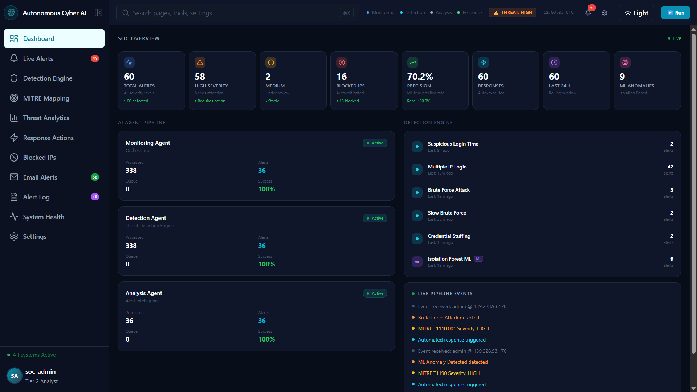
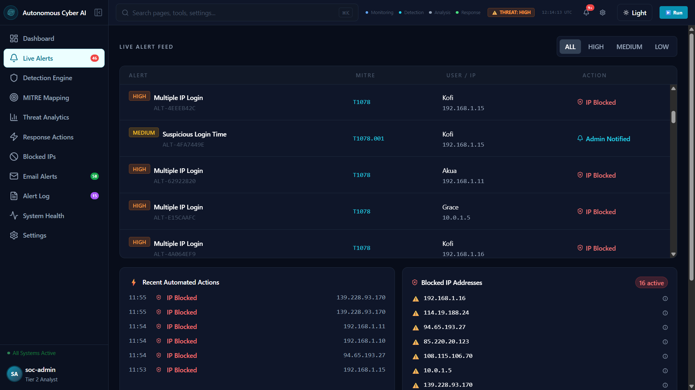
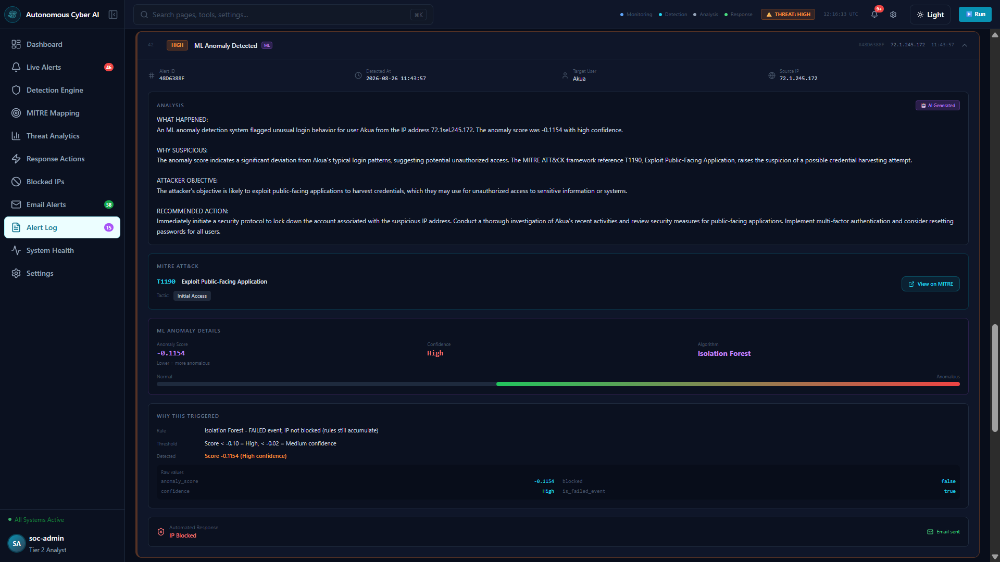
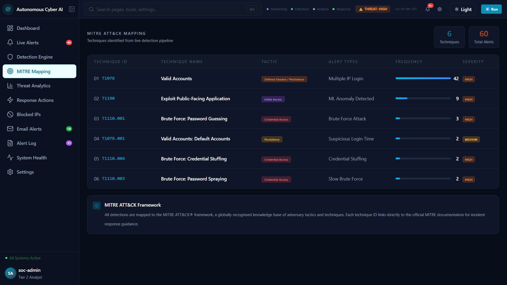
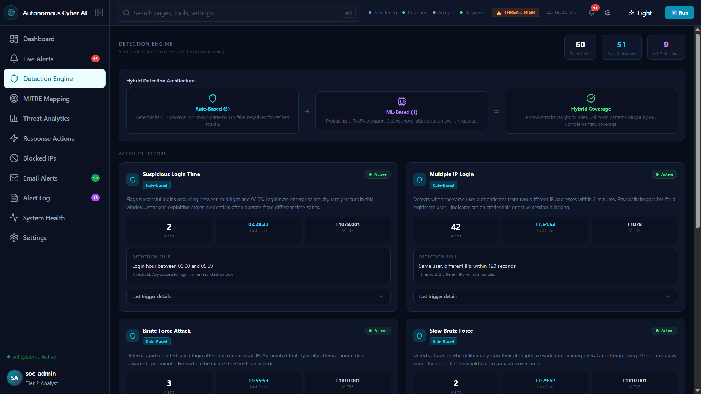
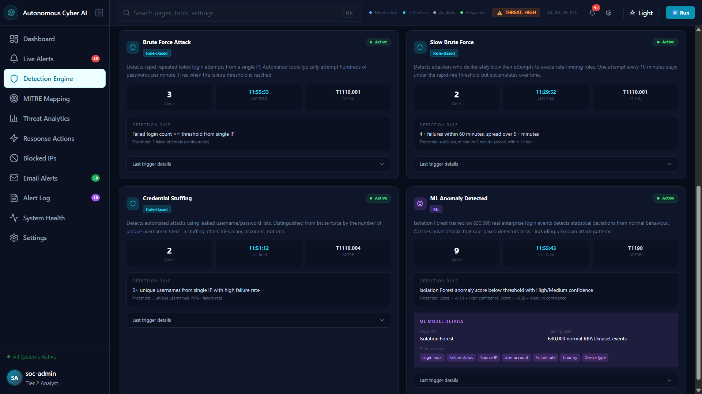
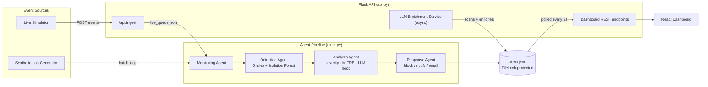

# Autonomous Cyber Threat Monitoring and Response System Using Agentic AI

[](LICENSE)
[](https://www.python.org/downloads/)
[](https://react.dev/)
[]()

A multi-agent intrusion detection system that combines rule-based detection, unsupervised machine learning (Isolation Forest), and LLM-based alert enrichment to detect and respond to authentication-based cyber threats in real time - developed as a final-year BSc Computer Science research project at the University of Ghana.

> **TL;DR** - Four cooperating agents (Monitoring → Detection → Analysis → Response) watch a stream of login events, flag suspicious behaviour using five deterministic rules _and_ an Isolation Forest model trained on 630,000 real-world authentication events, enrich each alert with a locally-run LLM explanation, map it to MITRE ATT&CK, and surface everything on a live React dashboard.

---

## Table of Contents

- [Autonomous Cyber Threat Monitoring and Response System Using Agentic AI](#autonomous-cyber-threat-monitoring-and-response-system-using-agentic-ai)
  - [Table of Contents](#table-of-contents)
  - [Motivation](#motivation)
  - [Key Features](#key-features)
  - [Screenshots](#screenshots)
  - [Architecture](#architecture)
  - [Detection Engine](#detection-engine)
  - [ML Model Performance](#ml-model-performance)
  - [Tech Stack](#tech-stack)
  - [Project Structure](#project-structure)
  - [Project Structure](#project-structure-1)
  - [Getting Started](#getting-started)
  - [Dataset \& Attribution](#dataset--attribution)
  - [Roadmap](#roadmap)
  - [Limitations](#limitations)
  - [Related Work](#related-work)
  - [Citation](#citation)
  - [License](#license)
  - [Acknowledgments](#acknowledgments)

---

## Motivation

Security Operations Centers face two compounding problems: **alert fatigue**, where analysts are overwhelmed by the volume of low-signal notifications from purely rule-based systems, and **dwell time**, where the gap between an attacker's initial access and eventual detection is measured in days or weeks rather than minutes. Purely deterministic detectors catch known attack patterns reliably but miss novel behaviour; purely statistical detectors catch novel behaviour but produce noisy, hard-to-interpret output.

This project explores a **hybrid** answer: deterministic rules for known attack signatures (brute force, credential stuffing, impossible travel, off-hours access) running alongside an unsupervised anomaly detector for everything the rules don't anticipate, with an LLM layer translating raw detector output into analyst-readable explanations.

## Key Features

- **Four-agent pipeline** - Monitoring, Detection, Analysis, and Response agents operate as a sequential pipeline, each with a single clear responsibility.
- **Six detectors, two paradigms** - five deterministic rule-based detectors (brute force, slow/evasive brute force, credential stuffing, multi-IP login, off-hours login) plus one Isolation Forest anomaly detector trained on real authentication telemetry.
- **Feature-level ML explainability** - every ML-flagged alert ships with a per-feature standard-deviation breakdown against the training baseline, so "the model flagged this" is never a black box.
- **LLM-powered enrichment** - a locally-hosted `phi3:mini` model (via Ollama) generates structured, analyst-style explanations for every alert, running asynchronously so it never blocks the detection pipeline.
- **MITRE ATT&CK mapping** - every alert type is mapped to a specific ATT&CK technique ID and tactic.
- **Automated response simulation** - severity-driven simulated actions (IP blocking, email notification, admin alerting) with a real Gmail SMTP integration for HIGH-severity alerts.
- **Live and batch operation** - a live streaming mode (`/api/ingest` + polling agent) alongside a deterministic batch/demo mode that guarantees all six attack scenarios fire for reproducible evaluation.
- **Full-featured React dashboard** - eleven pages covering live alerts, alert history, detection engine internals, MITRE mapping, blocked IPs, email alert log, system health, and threat analytics, with light/dark theming and a fully responsive mobile layout.

## Screenshots

| Dashboard Overview                           | Live Alert Feed                                  |
| -------------------------------------------- | ------------------------------------------------ |
|  |  |

| Alert Detail (ML Explainability)                   | MITRE ATT&CK Mapping                                 |
| -------------------------------------------------- | ---------------------------------------------------- |
|  |  |

| Detection Engine — Hybrid Architecture Overview                       | Detection Engine — All 6 Detectors                                     |
| --------------------------------------------------------------------- | ---------------------------------------------------------------------- |
|  |  |

## Architecture

See [`docs/ARCHITECTURE.md`](docs/ARCHITECTURE.md) for the full breakdown. High-level flow:



## Detection Engine

| Detector              | Type             | Trigger                                                              |
| --------------------- | ---------------- | -------------------------------------------------------------------- |
| Brute Force Attack    | Rule-based       | ≥5 failed logins from one IP                                         |
| Slow Brute Force      | Rule-based       | ≥4 failures spread over 5+ minutes, evading rapid-fire thresholds    |
| Credential Stuffing   | Rule-based       | ≥5 unique usernames attempted from one IP with high failure rate     |
| Multiple IP Login     | Rule-based       | Same user authenticated from two IPs within 120 seconds              |
| Suspicious Login Time | Rule-based       | Successful login between 00:00–05:59                                 |
| ML Anomaly Detection  | Isolation Forest | Statistical deviation from a 630,000-event normal-behaviour baseline |

Detector evaluation order is deliberate - slow brute force and credential stuffing are checked _before_ the fast brute-force threshold to prevent misclassification (see [`docs/DECISIONS.md`](docs/DECISIONS.md), Decision 9).

## ML Model Performance

Evaluated on a held-out RBA Dataset split (real-world login telemetry, see [Dataset & Attribution](#dataset--attribution)):

| Metric        | Value                                                                                                       |
| ------------- | ----------------------------------------------------------------------------------------------------------- |
| Precision     | 70.2%                                                                                                       |
| Recall        | 60.9%                                                                                                       |
| F1-Score      | 65.2%                                                                                                       |
| Training size | 630,000 normal login events                                                                                 |
| Algorithm     | Isolation Forest, contamination=0.15, 200 estimators                                                        |
| Features      | 10 (cyclic hour encoding, IP/user/country/device identity, cumulative failure rate, novel-IP/country flags) |

## Tech Stack

**Backend:** Python 3.12 · Flask · scikit-learn (Isolation Forest) · pandas/numpy · Ollama (`phi3:mini`) · FileLock

**Frontend:** React · Tailwind CSS · Recharts · lucide-react

**Data:** [Wiefling et al.'s RBA Dataset](https://github.com/vs-uulm/2021-RBA-Dataset) (Kaggle mirror)

## Project Structure

## Project Structure

```
.
├── backend/
│   ├── main.py                  # Entry point — batch and live modes
│   ├── api.py                   # Flask REST API + LLM enrichment service
│   ├── live_simulator.py        # Continuous event generator for live-mode demos
│   ├── requirements.txt
│   ├── .env.example
│   ├── agents/
│   │   ├── monitoring_agent.py  # Orchestrator — batch + live streaming
│   │   ├── detection_agent.py   # 6 detectors (5 rule-based + 1 ML)
│   │   ├── analysis_agent.py    # Severity, MITRE mapping, LLM explanation
│   │   └── response_agent.py    # Simulated block / notify / email
│   ├── ml/
│   │   ├── anomaly_model.py     # Isolation Forest wrapper, 10-feature extraction
│   │   ├── train_from_dataset.py# RBA dataset trainer
│   │   └── explainer.py         # Feature-level deviation explainability
│   └── utils/
│       ├── alert_manager.py     # FileLock-protected JSON persistence
│       ├── llm_analyzer.py      # phi3:mini via Ollama, async enrichment
│       ├── log_generator.py     # Synthetic log + training data generator
│       ├── log_parser.py        # Raw log text → structured JSON
│       └── email_alerter.py     # Gmail SMTP alerting
├── frontend/
│   ├── .env.example
│   └── src/
│       ├── App.js
│       ├── components/          # Sidebar, Navbar
│       └── pages/                # 11 dashboard pages
├── docs/
│   ├── ARCHITECTURE.md
│   ├── SETUP.md
│   ├── DECISIONS.md
│   └── screenshots/
├── CITATION.cff
├── CONTRIBUTING.md
├── LICENSE
├── .gitignore
└── README.md
```

## Getting Started

Full instructions in [`docs/SETUP.md`](docs/SETUP.md). Quick version:

```bash
# Backend
cd backend
pip install -r requirements.txt --break-system-packages
cp .env.example .env   # fill in your own values
python main.py --delay 0.1        # batch demo mode

# In separate terminals, for live mode:
python api.py
python main.py --live
python live_simulator.py --rate 1.0 --attack-interval 60

# Frontend
cd frontend
npm install
cp .env.example .env
npm start
```

## Dataset & Attribution

The ML model is trained on the **RBA (Risk-Based Authentication) Dataset**, introduced by Wiefling et al. As the dataset's own authors describe it, it is a privacy-preserving _synthetic reconstruction_ of real production login telemetry - ground-truth labels and statistical structure are preserved from the original data, while individual field values are regenerated. It is not raw, identifiable enterprise data.

> Wiefling, S., Lo Iacono, L., & Dürmuth, M. (2019). Is this really you? An empirical study on risk-based authentication applied in the wild. _IFIP International Conference on ICT Systems Security and Privacy Protection._

## Roadmap

- [ ] MCP (Model Context Protocol) integration for agent tool-calling
- [ ] Split deployment (Vercel frontend / Render backend)
- [ ] Persistent database backend in place of flat-file `alerts.json`
- [ ] Configurable detection thresholds via a settings API rather than source edits

## Limitations

- IP blocking is **simulated** - no integration with a real firewall/iptables.
- Persistence is a single flat JSON file (`alerts.json`), locked with `FileLock`; suitable for a research prototype, not a multi-instance production deployment.
- LLM enrichment latency is hardware-dependent (60–90s per alert on modest GPUs) and runs asynchronously for this reason.
- Evaluation metrics are reported on a balanced held-out split; real-world deployment with a low base attack rate would show different precision/recall trade-offs.

## Related Work

This project builds on and engages with prior work in hybrid intrusion detection and unsupervised anomaly detection, including comparative studies of Isolation Forest vs. Random Forest for log-based anomaly detection, hybrid rule/ML intrusion detection architectures, and SOC automation literature on alert fatigue and attacker dwell time. Full references are in the accompanying thesis.

## Citation

If you reference this work, please cite it as:

```bibtex
@misc{agentic-cyber-ids-2026,
  author = {Deegbe Cephas Dotse Klenam},
  title  = {Autonomous Cyber Threat Monitoring and Response System Using Agentic AI},
  year   = {2026},
  institution = {University of Ghana, Department of Computer Science},
  howpublished = {\url{https://github.com/klenam0/Autonomous-Cyber-Threat-Monitoring-and-Response-System-Using-Agentic-AI}}
}
```

See [`CITATION.cff`](CITATION.cff) for the machine-readable version (GitHub renders a "Cite this repository" button automatically once this file is present).

## License

MIT - see [LICENSE](LICENSE).

## Acknowledgments

- University of Ghana, Department of Computer Science
- Wiefling et al. for the RBA Dataset
- The open-source maintainers of scikit-learn, Flask, React, and Ollama
