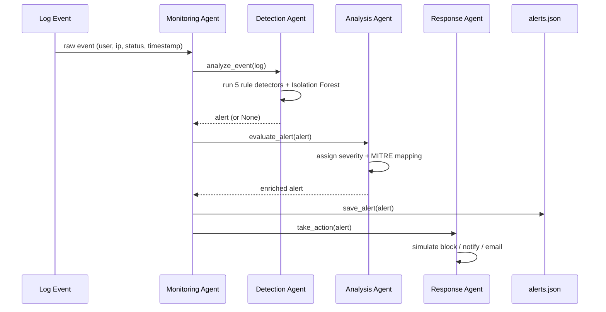
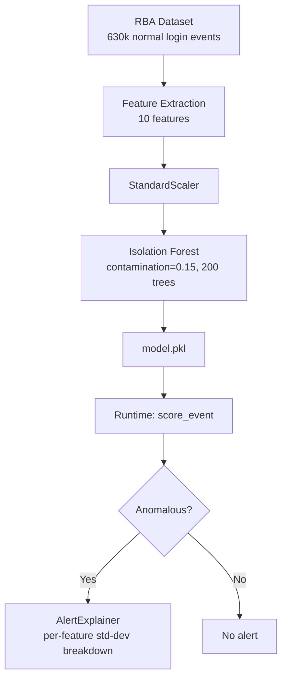

# Architecture

## Overview

The system is split into two processes that communicate through a shared filesystem and a REST API - deliberately, not incidentally:

1. **`main.py`** - the detection pipeline. Runs either as a one-shot batch job (`python main.py`) or as a long-lived live poller (`python main.py --live`). This process owns the four agents and is the only writer of `alerts.json`.
2. **`api.py`** - the Flask REST API. Long-lived, serves the React dashboard, exposes `/api/ingest` for external event sources, and runs the LLM enrichment service as a background thread.

This split exists because of a hard timing constraint: LLM enrichment via `phi3:mini` takes 60–90 seconds per alert on modest hardware. If enrichment ran synchronously inside the detection pipeline, every alert would stall event processing for up to a minute and a half. By running enrichment as a background thread inside the _persistent_ API process - rather than inside `main.py`, which exits after a batch run - enrichment can proceed independently of, and without blocking, detection.

## The Four Agents



### Monitoring Agent

Orchestrator. Owns two independent code paths sharing a common `_process_event()`:

- **Batch (`stream_logs`)**: reads a pre-generated `parsed_logs.json`, walks it once, saves per-run stats, exits.
- **Live (`stream_live`)**: polls `live_queue.jsonl` on an interval, tracking a durable read cursor (`live_queue.jsonl.cursor`) so the process can be restarted without reprocessing already-seen events. See the queue/cursor invariant note below - this is a common source of confusion if the queue file and its cursor are ever reset independently of one another.

### Detection Agent

Runs six detectors in a fixed, load-bearing order against every event:

1. Suspicious Login Time
2. Multiple IP Login
3. _(For FAILED events only, in this exact order)_ Slow Brute Force → Credential Stuffing → Fast Brute Force
4. ML Anomaly Detection (Isolation Forest), for any event not otherwise classified

The ordering in step 3 is not cosmetic. Slow brute force and credential stuffing are checked before the fast brute-force threshold specifically because both would otherwise be misclassified as ordinary brute force once the failure count crosses the fast-brute-force threshold. See `docs/DECISIONS.md`, Decision 9.

The ML detector treats `FAILED` and `SUCCESS` events differently: a flagged `FAILED` event triggers an alert but does **not** block the IP, so the rule-based detectors downstream can still accumulate the failure count they need to fire; a flagged `SUCCESS` event blocks immediately, since no rule-based detector covers a suspicious successful login (e.g., account takeover from an unrecognized IP). See Decision 6.

### Analysis Agent

Enriches a raw detector output with:

- Severity classification (HIGH / MEDIUM / LOW, with ML anomalies upgraded to HIGH on high-confidence scores)
- A unique alert ID and timestamp
- MITRE ATT&CK technique/tactic mapping
- An explanation - LLM-generated when available, template-based fallback otherwise
- Feature-level ML explainability, when the underlying alert came from the Isolation Forest

### Response Agent

Maps severity to a simulated action:

- **HIGH** → simulated IP block + real Gmail SMTP email
- **MEDIUM** → simulated admin notification
- **LOW** → logged for review only

## ML Pipeline



The model is trained **offline only** - `train_from_dataset.py` is a separate, one-time (or periodically re-run) process. At runtime, `AnomalyDetector` loads the saved `model.pkl` and performs inference exclusively; it never retrains on live data. This two-phase design mirrors how production SIEM platforms operate and avoids the circular-validation problem of testing a model on the same live data it's being updated from.

### The 10 features

| #   | Feature          | Description                                                  |
| --- | ---------------- | ------------------------------------------------------------ |
| 0   | `hour_sin`       | Cyclic encoding of login hour (sine component)               |
| 1   | `hour_cos`       | Cyclic encoding of login hour (cosine component)             |
| 2   | `is_failed`      | 1 if login failed                                            |
| 3   | `ip_enc`         | Label-encoded source IP                                      |
| 4   | `user_enc`       | Label-encoded username                                       |
| 5   | `failed_rate`    | Cumulative per-IP failure ratio (inclusive of current event) |
| 6   | `country_enc`    | Label-encoded country                                        |
| 7   | `device_enc`     | Label-encoded device type                                    |
| 8   | `is_new_ip`      | 1 if this IP was never seen during training                  |
| 9   | `is_new_country` | 1 if this country was never seen during training             |

Cyclic hour encoding (rather than a raw 0–23 integer) avoids a discontinuity at the 23:00/00:00 boundary, which a linear encoding would otherwise treat as maximally distant.

## Data Flow: Live Mode

```
live_simulator.py --> POST /api/ingest --> live_queue.jsonl (append-only)
                                                   |
                                      main.py --live polls on an interval,
                                      tracking read position in
                                      live_queue.jsonl.cursor
                                                   |
                                    MonitoringAgent -> Detection -> Analysis -> Response
                                                   |
                                              alerts.json (FileLock-protected)
                                                   |
                          api.py serves /api/alerts, /api/stats, etc. to the dashboard,
                          which polls every 2 seconds
```

**Invariant to preserve:** `live_queue.jsonl` and `live_queue.jsonl.cursor` must always be reset together. The queue is an append-only log; the cursor is a durable read pointer into it. If the queue file is truncated or cleared without also resetting the cursor, the live agent will silently wait forever for the file to grow back past a cursor position that no longer exists. `MonitoringAgent._read_queue()` includes a guard that detects this condition (cursor beyond current file length) and self-corrects by resetting the cursor to zero, but the cleanest way to reset live-mode state is the paired `/api/queue/clear` endpoint, which clears both files atomically.

## Concurrency & File Safety

Two separate processes (`main.py` and `api.py`) both read and write `alerts.json`. Python's `threading.Lock()` only synchronizes within a single process, so this project uses `filelock.FileLock` for cross-process safety on every read-modify-write cycle against `alerts.json`, `live_queue.jsonl`, and their respective lock files.

## Why Two Processes Instead of One

An earlier design ran everything - detection and enrichment - inside a single process. This was abandoned because a synchronous LLM call inside the detection loop stalled event processing for the full duration of the LLM request. Splitting into a persistent API process (which can absorb background async work) and a pipeline process (which needs to complete or continuously poll without blocking) resolved this without needing a message queue or additional infrastructure.
